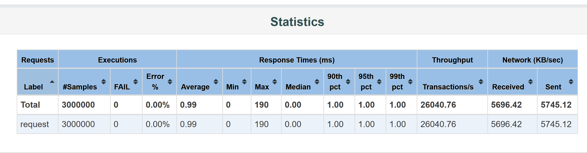

Solution notes
==========================================
To run the app, use sbt: 
```    
sbt run
```
I decided to solve the problem using an akka actor and akka-http.
The performance seems to be really good when running the jmeter test plan, see below picture 
and full analysis in the html report in the performance_out folder.



In order to not spend too much time on the challenge, I did not implement all the error handling
and testing of edge cases. I have added pending tests to indicate what functionality is missing
and should be covered for a more production ready solution.

